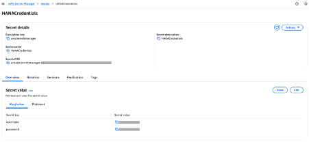
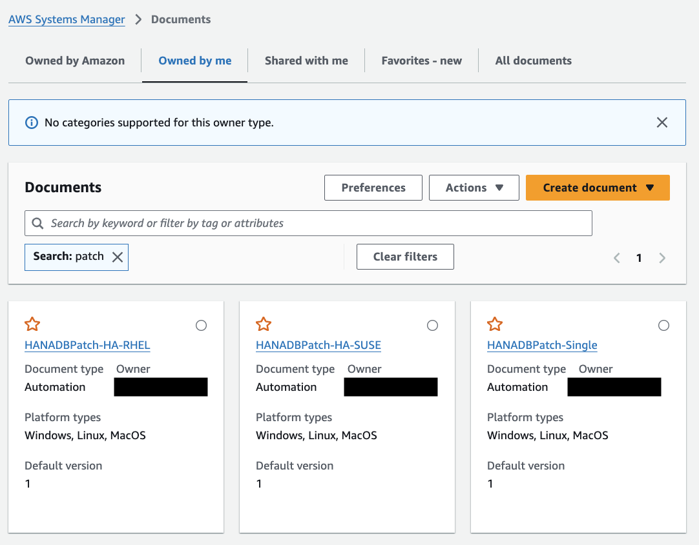
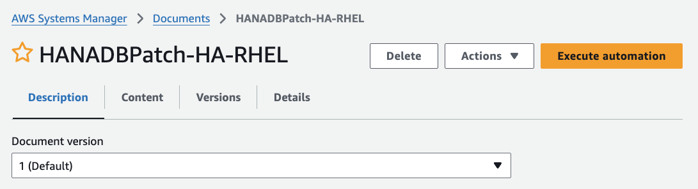
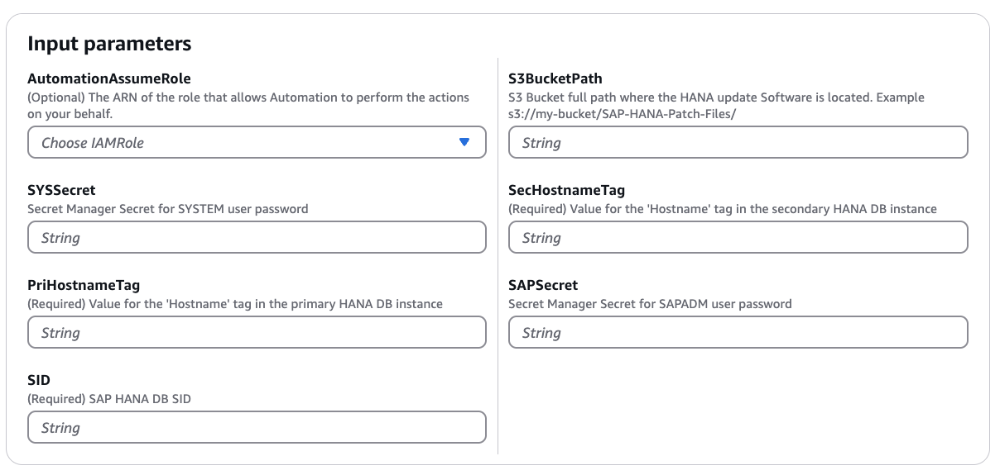

# sample-hana-db-patch-ha

Use this repository for patching your SAP HANA Database (HA or not). For the full benefits, architectural diagrams and flow of execution, check out the original blog post at this URL.

Check below the pre requisites required for running this tool, and the How to Run section below it for the step-by-step execution.

## Pre-requisites

Please ensure following pre-requisites are met prior to using this code for updating your HANA DB in HA setup:

1. Ensure you have a pre-configured SAP HANA 2.0+ database environment running in high availability mode on your AWS EC2 instances. While we won't cover the initial setup in this blog, you're welcome to explore our SAP on AWS 
<a href="https://docs.aws.amazon.com/sap/latest/sap-hana/sap-oip-sap-on-aws-high-availability-setup.html" target="_blank">documentation</a> if you need assistance with the configuration.

2. Ensure you have configured a user account in your SAP HANA SYSTEMDB with sufficient privileges to perform database updates. This user will be referenced in the automation process, so it's essential to verify the account has all necessary authorizations before proceeding with the upgrade.
we strongly recommend following the principle of least privilege when configuring your SAP HANA database user permissions. For more details see, <a href="https://help.sap.com/docs/SAP_HANA_PLATFORM/2c1988d620e04368aa4103bf26f17727/df3de8c31cef45c0847d2804b97604ea.html" target="_blank">Create a Lesser-Privileged Database User for Update.</a>

3. Verify that your SAP HANA database EC2 instances are managed by <a href="https://docs.aws.amazon.com/systems-manager/latest/userguide/systems-manager-setting-up-ec2.html" target="_blank">AWS Systems Manager</a>. This is essential as our automation solution leverages Systems Manager's capabilities for seamless management and operations.

4. Ensure your SAP HANA database instances have the necessary permissions to access the Amazon S3 bucket containing your SAP HANA software media. This access is crucial for the automation process to retrieve the required installation files seamlessly. 
For your reference, here is a sample Amazon S3 bucket policy below. This example demonstrates how to grant a specific IAM role within your account the necessary permissions to download files from your S3 bucket. Feel free to customize this policy according to your security requirements.

```
{
    "Version": "2012-10-17",
    "Statement": [
        {
            "Sid": "AddPerm",
            "Effect": "Allow",
            "Principal": {
                "AWS": "arn:aws:iam::{account_id}:role/service-role/{ec2_role}"
            },
            "Action": [
                "s3:GetObject",
                "s3:GetObjectVersion",
                "s3:ListBucket"
            ],
            "Resource": [
                "arn:aws:s3:::{bucket_name}/*",
                "arn:aws:s3:::{bucket_name}"
            ]
        }
    ]
}
```

For more information, please refer 
* <a href="https://docs.aws.amazon.com/AmazonS3/latest/userguide/access-policy-language-overview.html" target="_blank">Policies and Permissions in Amazon S3</a>
* <a href="https://docs.aws.amazon.com/AmazonS3/latest/userguide/security-best-practices.html" target="_blank">Security best practices for Amazon S3</a>

5. If you're leveraging a central or shared services account for automation (recommended AWS best practice), <a href="https://docs.aws.amazon.com/systems-manager/latest/userguide/running-automations-multiple-accounts-regions.html" target="_blank">ensure you have the appropriate cross-account permissions configured</a> before proceeding.

6. The automation relies on AWS Secrets Manager to securely retrieve the necessary SAP HANA database credentials. Ensure you have created the required secrets (sapadm user password and SYSTEM user password) in AWS Secrets Manager and configured appropriate permissions for your target AWS account to access these secrets.
Below, we're sharing a sample cross-account policy for AWS Secrets Manager. This example illustrates how to configure permissions that allow a specific AWS account to access secrets stored in another account. You can use this as a reference and adapt it to align with your organization's security requirements.

```
{
  "Version" : "2012-10-17",
  "Statement" : [ {
    "Effect" : "Allow",
    "Principal" : {
      "AWS" : "arn:aws:iam::{sap_workloads_account_id}:role/service-role/{ec2_role}"
    },
    "Action" : "secretsmanager:GetSecretValue",
    "Resource" : "arn:aws:secretsmanager:{region}:{automation_account_id}:
    {secret_ARN}"
  } ]
}
```

For your reference, we've included a sample structure of how your AWS Secrets Manager secret should be configured. This example demonstrates the expected format and key-value pairs needed for the automation to work correctly. Please ensure your secrets follow a similar structure while using your actual credentials.



7.	To enable secure cross-account access to sensitive information, our solution utilizes AWS Secrets Manager with AWS KMS encryption. The encrypted secrets are protected by a KMS key that must be accessible to all participating AWS accounts. This setup ensures secure parameter sharing while maintaining proper access controls across your AWS environment. For detailed guidance on configuring cross-account secrets access, please refer to our <a href="https://docs.aws.amazon.com/kms/latest/developerguide/control-access.html" target="_blank">documentation</a>.

Below, we provide the default KMS key policy statement that's automatically applied when creating KMS keys programmatically. If you're using the AWS KMS console to create your keys, you'll find this as the primary policy statement in your default configuration. You can use this as a reference while setting up cross-account access for your encryption needs.

```
{
  "Sid": "Enable IAM User Permissions",
  "Effect": "Allow",
  "Principal": {
    "AWS": "arn:aws:iam::111122223333:root"
   },
  "Action": "kms:*",
  "Resource": "*"
}
```

8.	Space requirement for S3 sync on EC2 local storage
9.	Add a tag to your HANA DB EC2 instances named “Hostname: <hostname>”. You will use their hostname value for running the solution in a step below.

## How to run the code

Follow the steps below to use the code contained in this repository to get your HANA Databases updated.

1. Create the secrets required on SecretsManager on the same account you have your HANA Databases. Follow the example given on step 6 of the Pre-Requisites section.
2. Create the S3 bucket where you will upload the update files to.
3. Use the CloudFormation creating a stack guide to deploy the solution. In the repository, under folder cloudformation, you’ll find 3 different files to be used according to your environment:
* hana_db_patch – to be used for databases not configured for HA. This procedure will cause downtime in the target database.
* hana_db_patch_ha_rhel – to be used for databases configured for HA in a RHEL system. This will achieve the nZDT concept explained in the Introduction.
* hana_db_patch_ha_suse – to be used for databases configured for HA in a SUSE system. This will achieve the nZDT concept explained in the Introduction.
4. Go to Systems Manager > Documents > select tab “Owned by me” > search for “patch” and open your applicable doc:



5. Select “Execute automation” on the top right corner:



6. Fill in the required input parameters:



7.	Scroll down and select “Execute”.
8.	Add screenshot of the successful result

## Security

See [CONTRIBUTING](CONTRIBUTING.md#security-issue-notifications) for more information.

## License

This library is licensed under the MIT-0 License. See the LICENSE file.

